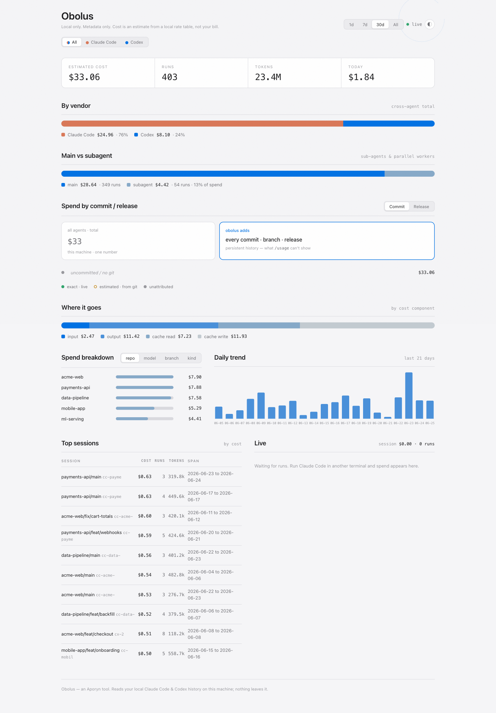
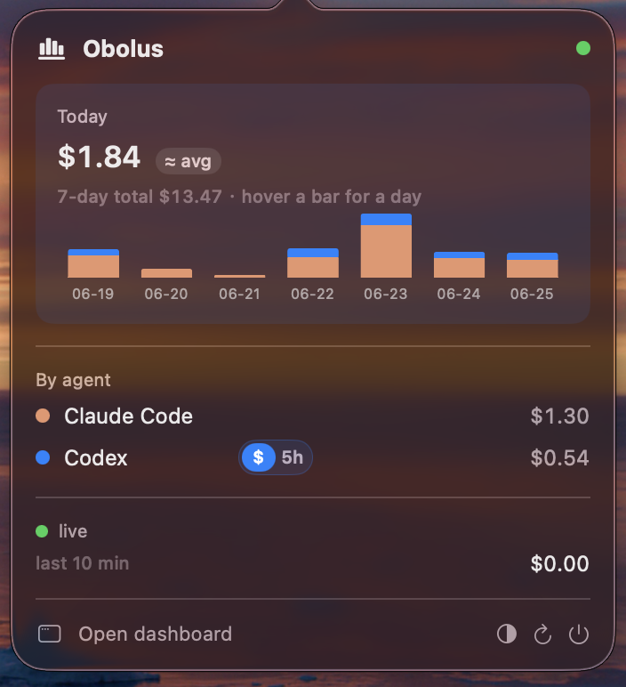
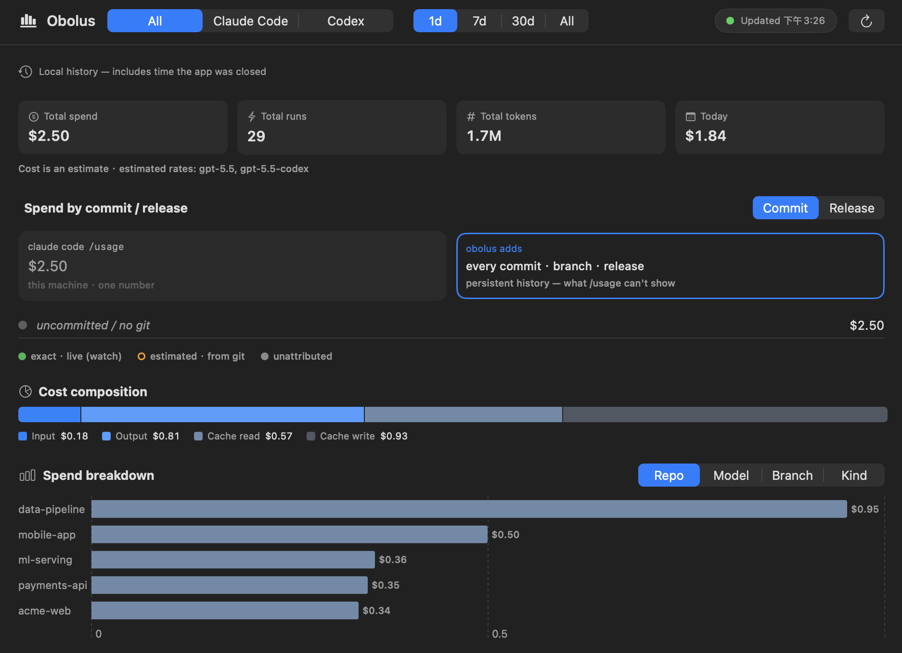
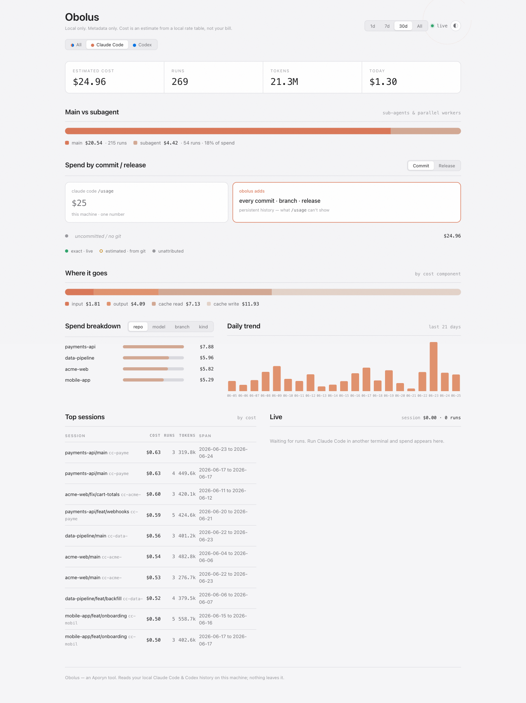
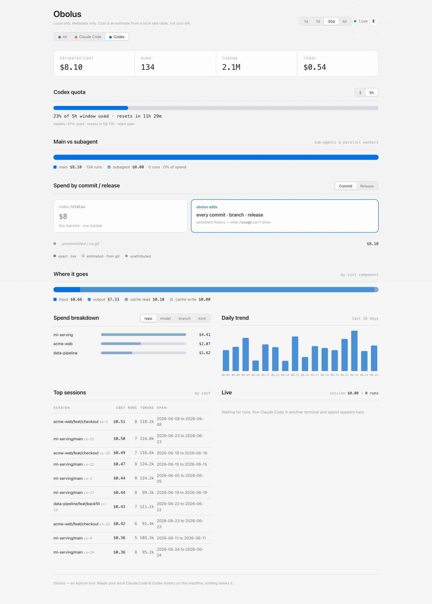
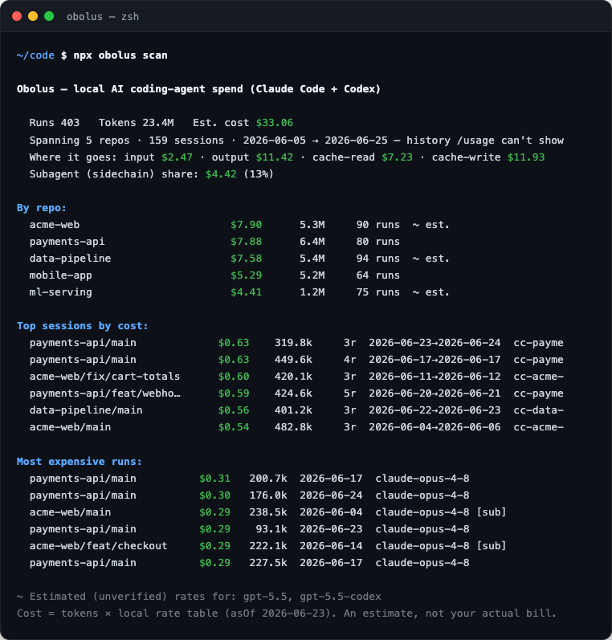

<div align="center">

# Obolus

**Observability for AI coding-agent spend.**
See what every repo, branch, commit, and run actually costs across **Claude Code** and **OpenAI Codex** — without sending your code or prompts anywhere.

[](https://www.npmjs.com/package/obolus)
[](./LICENSE)


</div>

> *Obolus* was the small coin the ancient Greeks placed under the tongue to pay Charon, the ferryman.
> Obolus watches the small coins your agents spend — before they add up to a fare you never meant to pay.

<div align="center">

<picture>
  <source media="(prefers-color-scheme: dark)" srcset="docs/images/web-dashboard-all-dark.png" />
  
</picture>

</div>

```sh
npx obolus serve --open     # local dashboard, zero config
# or
npx obolus scan             # one-shot terminal report
```

No setup, no API key, no telemetry flag. Obolus reads the local session history your agents already write, and everything stays on your machine.

---

## Why

Coding-agent spend is **volatile and invisible**: a single agent run is roughly **1000×** a chat turn, the *same task* can vary up to **30×** run-to-run, and models routinely underestimate their own cost. Native `/usage` shows you *one number for this machine* — not which repo, branch, commit, or run burned it, and not across vendors.

Obolus makes that spend legible: **cross-run, per-repo / branch / commit / day history**, split by vendor, that `/usage` can't give you.

---

## Three ways to see it

### 🖥️ Menu-bar app

A native macOS menu-bar app. The popup leads with **today vs. your daily average** and a 7-day trend whose bars are **stacked by vendor** — Claude Code in clay-orange, Codex in blue — so you read the *proportion* at a glance, not a flat sum. Codex carries a one-tap **`$ ↔ 5h`** toggle for its rolling rate-limit quota (which Claude Code doesn't expose).

<div align="center">
  
  &nbsp;&nbsp;&nbsp;
  
</div>

### 🌐 Web dashboard — `obolus serve`

A private dashboard bound to `127.0.0.1` — **nothing leaves your machine**. It reads your history and, while it runs, tails your active sessions itself, so the view stays live as you work. Switch between **All · Claude Code · Codex** tabs; each vendor carries its own accent, and Codex adds a rolling **5h / weekly quota** gauge.

<div align="center">
  
  
</div>

```sh
obolus serve              # http://localhost:4317
obolus serve --open       # …and open it in your browser
obolus serve --port 8080  # pick a port
```

### ⌨️ CLI — `obolus scan`

A fast terminal report when you just want the numbers. Group by repo, model, branch, day, week, main-vs-subagent, **commit**, or **release**.

<div align="center">
  
</div>

```sh
obolus scan                            # all history, grouped by repo
obolus scan --since 7d                 # only the last 7 days
obolus scan --by day                   # daily spend trend
obolus scan --by commit                # spend per commit — the view /usage can't give you
obolus scan --by kind                  # main thread vs subagent (sidechain)
obolus scan --repo myapp --by branch   # one repo, broken down by branch
obolus scan --model claude-opus-4-8    # only one model
obolus scan --json                     # machine-readable output
```

Dimensions for `--by`: `repo` · `model` · `branch` · `day` · `week` · `kind` · `commit` · `release`.

#### Live monitor — `obolus watch`

```sh
obolus watch
```

Tails active sessions and prints each run's cost the moment it happens — stamped with the **commit checked out at run time**, which a history scan can't see. Records append to `~/.obolus/live-ledger.jsonl` (metadata only). `Ctrl+C` to stop.

---

## Vendors

| | Claude Code | OpenAI Codex |
|---|---|---|
| Per repo / branch / commit / day | ✅ | ✅ |
| Main vs. subagent split | ✅ | ✅ |
| Cost composition (input / output / cache) | ✅ | ✅ |
| Live `watch` with commit attribution | ✅ | ✅ |
| Rolling **5h / weekly quota** gauge | — | ✅ |

Obolus joins both vendors into one vendor-neutral model, so a repo that uses both shows up under both. **Cursor is next** on the roadmap.

> **Codex prices are best-effort estimates.** OpenAI's public per-model rates aren't all confirmed in the bundled rate table yet, so Codex rows are flagged *estimated*. Claude Code rates are verified.

---

## How it works · privacy

Obolus reads the **local session transcripts your agents already write** — `~/.claude/projects/**` (Claude Code) and `~/.codex/sessions/**` (Codex) — extracts **metadata only**, and attributes it to repo / branch / commit.

These are the invariants the collector holds to:

- **Local & offline.** Free local mode never makes a network call. The dashboard binds to `127.0.0.1`.
- **Metadata only.** Token counts, cost, model, repo, branch, timestamps. **Never your code or prompts.** The readers allowlist specific fields and drop everything else.
- **Legitimate sources only.** It parses the vendors' own local files — no consumer-subscription OAuth tokens, no undocumented quota endpoints.
- **Cost is an estimate.** `tokens × a local public-rate table`, not your actual bill. Quota percentages are best-effort.

---

## Install

```sh
npx obolus scan          # try it with no install
npm i -g obolus          # or install the CLI globally
```

**Menu-bar app (macOS):** build it from source — `apps/desktop/build-app.sh --bundle-runtime --install` produces `Obolus.app` (it spawns `obolus serve` as a headless data engine and renders natively). Same local tier: observe-only, metadata-only.

### Configuration

| Env var | Purpose |
|---|---|
| `CLAUDE_CONFIG_DIR` | Override the Claude Code root (default `~/.claude`). |
| `CODEX_HOME` | Override the Codex root (default `~/.codex`). |
| `OBOLUS_NODE` / `OBOLUS_DIST` | (app) point the bundled serve at a dev build. |

---

## Roadmap

Local collector (Claude Code + Codex) → Cursor support → server + GitHub App PR cost comments → team dashboard. **Open-core:** the collector + CLI + local dashboard are free and fully local; hosted team aggregation is the paid layer.

## License

MIT — collector / CLI. An [Aporyn](https://github.com/Aporyn) tool.
